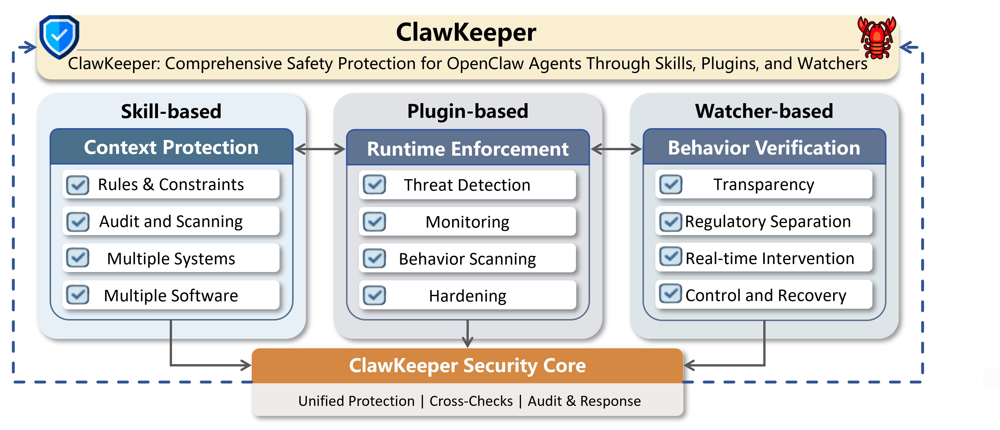

# 🦞🛡️ ClawKeeper: Comprehensive Safety Protection for OpenClaw Agents Through Skills, Plugins, and Watchers 

<h1 align="center"><i>(aka The Norton for OpenClaw)</i></h1>

<p align="center">
    
</p>

<p align="center">
  <strong>SAFETY EXFOLIATE! SAFETY EXFOLIATE!</strong>
</p>

<p align="center">
  <a href="https://github.com/openclaw/openclaw">
    
  </a>
  <a href="https://opensource.org/licenses/MIT">
    
  </a>
</p>

**ClawKeeper** is a _comprehensive real-time security framework_ designed for autonomous agent systems such as **OpenClaw**. It provides unified protection through three complementary approaches: **skill-based** safeguards at the instruction level, **plugin-based** enforcement at the runtime level, and a **watcher-based** independent monitoring agent for external oversight.

# 🔎 Overview

**ClawKeeper** provides protection mechanisms across three complementary architectural layers:

- **Skill-based Protection** operates at the instruction level, injecting structured security policies directly into the agent context to enforce environment-specific constraints and cross-platform boundaries. 

- **Plugin-based Protection** serves as an internal runtime enforcer, providing configuration hardening, proactive threat detection, and continuous behavioral monitoring throughout the execution pipeline. 

- **Watcher-based Protection** introduces a novel, decoupled system-level security middleware that continuously verifies agent state evolution. It enables real-time execution intervention without coupling to the agent's internal logic, supporting operations such as halting high-risk actions or enforcing human confirmation. 

Importantly, **Watcher-based Protection** is **system-agnostic** and can be integrated with different agent platforms to provide regulatory separation between task execution and safety enforcement, enabling **proactive** and **adaptive** security across the entire agent lifecycle. It can be deployed both **locally** and in the **cloud**, supporting personal deployments as well as enterprise or intranet environments.


<p align="center">

</p>

# 📦 Installation

ClawKeeper supports three complementary protection mechanisms.

## 📚 I. [Skill-based Protection](clawkeeper-skill/README.md)

Inject security policies directly into the agent context through structured Markdown documents and scripts.

**Quick Start:**

### Windows Safety Guide
```powershell
cd clawkeeper-skill/skills/windows-safety-guide
./scripts/install.ps1
```

Then instruct OpenClaw:
```
Please use the windows-safety-guide skill to enforce behavior security policies, configuration protection, and enable nightly security audits.
```

### Feishu (Lark) Safety Guide
```bash
cd clawkeeper-skill/skills/feishu-safety-guide
bash scripts/install.sh
```

Then instruct OpenClaw:
```
Please use the feishu-safety-guide skill to enforce message protection, credential security, and enable periodic security reporting in Feishu (Lark).
```

For **detailed** setup options and deployment from prompt, see [Skill-based Protection](clawkeeper-skill/README.md).

---

## 📚 II. [Plugin-based Protection](clawkeeper-plugin/README.md)

A runtime enforcer plugin providing configuration auditing, threat detection, and behavioral monitoring.

**Quick Start:**

### Linux/macOS
```bash
cd clawkeeper-plugin
bash install.sh
```

### Windows
```powershell
cd clawkeeper-plugin
./install.ps1
```

Then verify installation:
```bash
npx openclaw clawkeeper audit
```

For **detailed** command reference and advanced usage, see [Plugin-based Protection](clawkeeper-plugin/README.md).

---

## 📚 III. [Watcher-based Protection](clawkeeper-watcher/README.md)

An independent, decoupled governance layer providing runtime monitoring and execution control without coupling to the agent's internal logic.

**Quick Start:**

### Prerequisites
- Node.js and npm/pnpm installed
- Git repository cloned

### Installation Steps

1. **Install repository dependencies:**
   ```bash
   pnpm install
   ```

2. **Build and link the launcher:**
   ```bash
   cd clawkeeper
   npm install
   npm run build
   npm link
   cd ..
   ```

3. **Initialize operating modes:**
   ```bash
   clawkeeper init remote
   clawkeeper init local
   ```

4. **Launch the watcher:**
   ```bash
   # Remote governance mode
   clawkeeper remote gateway run
   
   # Local governance mode
   clawkeeper local gateway run
   ```

For **detailed** configuration, command reference, and feature documentation, see [Watcher-based Protection](clawkeeper-watcher/README.md).

---


# 💡 Features



- **Comprehensive Security Scanning:** Regularly scans the runtime environment, dependencies, and workspace for vulnerabilities, providing clear and actionable risk alerts before threats occur.

- **Real-time Threat Prevention & Gating:** Evaluates AI actions in real time, blocking high-risk behaviors such as prompt injection, credential leakage, and code injection.

- **Behavioral Profiling & Anomaly Detection:** Builds long-term behavioral baselines for AI agents and detects anomalies when unusual actions, risky tool calls, or dangerous commands appear.

- **Intent Enforcement & Trajectory Analysis:** Monitors multi-turn interactions to ensure AI actions stay aligned with the user’s original intent and prevents goal drift, unsafe loops, or unauthorized actions.

- **Config Integrity & Drift Monitoring:** Protects critical configuration files and alerts users when unexpected changes weaken security settings or introduce new risks.

- **Automated Hardening & Remediation:** Provides vulnerability remediation suggestions, applies secure default configurations, and supports one-click rollback with automatic backups.

- **Third-Party Extension Shield:** Reviews and monitors external extensions and plugins to prevent malicious behavior or excessive permission access.

- **Comprehensive Logging & Auditing:** Maintains full logs of user inputs, AI outputs, tool usage, and security decisions for auditing, compliance, and traceability.

- **Self-Evolving Threat Intelligence:** Stores high-risk events and decisions to build a threat intelligence library that helps detect and prevent recurring or new attack patterns.

- **Cross-Platform Ecosystem Security:** Ensures consistent security protection across operating systems and third-party platforms, providing full ecosystem coverage.

---

# 🔬 Comparative Analysis of  Safety Paradigms in ClawKeeper

ClawKeeper offers a comprehensive suite of security mechanisms, allowing users to freely select and combine them according to their specific requirements, whether prioritizing runtime efficiency or security performance.


# 📈 Experiment Results

To systematically assess the security capabilities of ClawKeeper, we construct a benchmark comprising seven categories of safety tasks, each containing 20 adversarial instances divided equally into 10 simple and 10 complex examples. We compare ClawKeeper against the most prominent open-source security repositories for OpenClaw-style agent ecosystems.
The results showed that ClawKeeper achieved optimal defense performance.


---

# 🔥 Updates
- [2026-03-25] 🎉 ClawKeeper v1.0 has been released.

---

# 📝 License

This project is licensed under [MIT](https://opensource.org/licenses/MIT).